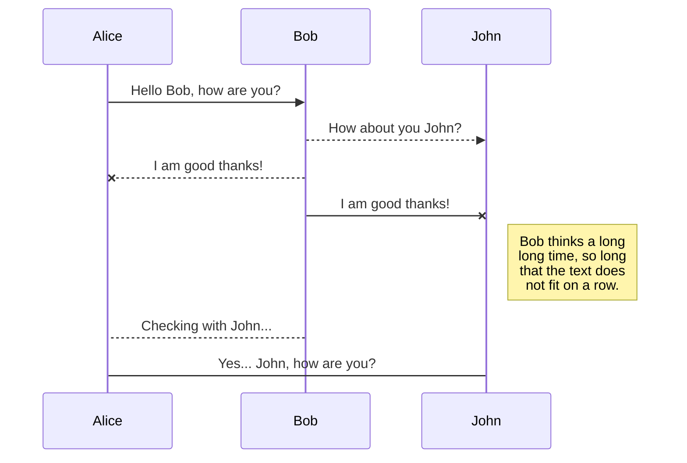
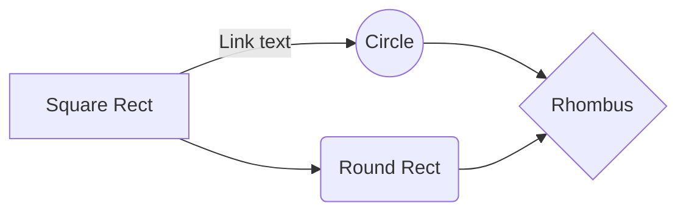

# Welcome to My Go!

# Example

Go Here [Handlebars templates](https://m5r6sdcyhj.execute-api.us-west-1.amazonaws.com/staging/books?department=BIO%20SCI&term=2019%20Fall&GE=ANY&courseNum=&courseCodes=&instructorName=&units=&endTime=&startTime=&fullCourses=ANY&building=/), .

## UML diagrams

And this will produce a flow chart:

